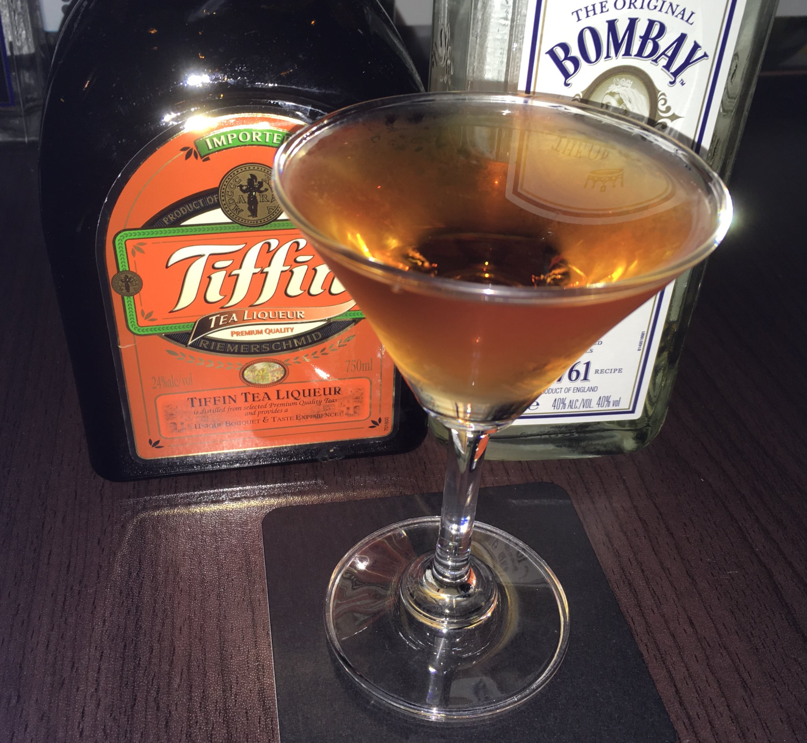

## ブリティッシュ・マティーニ  
  

### 材料
- ドライ・ジン 40ml
- ティフィン 20ml
- レモンピール

### 作り方
1. ミキシンググラスにドライ・ジンとティフィンを入れる
2. ステアする
3. グラスに注いだ後、レモンピールを絞る

### 参考URL
- [ブリティッシュ・マティーニ - カクテルタイプ](http://www.cocktailtype.com/recipe/recipe_0284.html)
