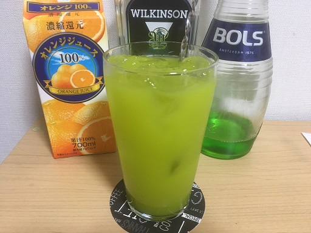

## メロンボール  
  

### 材料
- メロンリキュール 40ml
- ウオッカ 20ml
- オレンジジュース 適量

### 作り方
1. 氷を入れたタンブラーに材料を入れる
2. ステアする

### 参考URL
- [メロンボール - Wikipedia](https://ja.wikipedia.org/wiki/メロンボール)  
- [メロン・ボール 詳細情報　カクテルレシピ - Liqueur＆Cocktail - サントリー](http://cocktailrecipe.suntory.co.jp/wnb/cocktail/recipe/melon_ball/)
